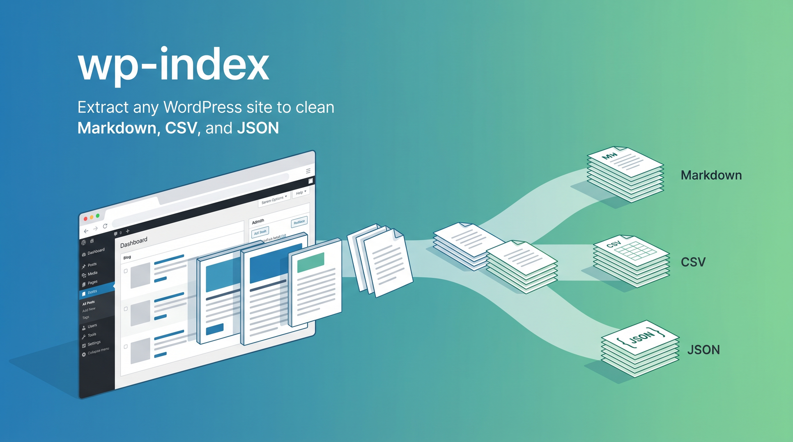
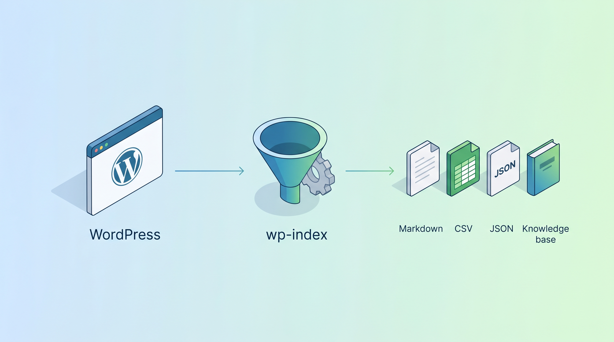
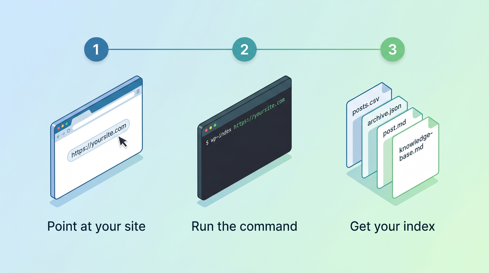

# wp-index

**Your WordPress content, set free.** Extract any WordPress site to clean Markdown, CSV, and JSON, from any Claude Code session, with zero install.

---

Your best content lives inside WordPress, and getting it back out is a chore. Exporting for an SEO audit, a site migration, or an AI knowledge base usually means wrestling with plugins, database dumps, or copy and paste. Content you own should not be this hard to use.

wp-index points at any WordPress site's public REST API and pulls every post, page, and custom post type into clean, structured files you actually own. One command, read-only against the site, nothing to install.

What you walk away with:

- A per-item Markdown file for every post and page, with YAML frontmatter.

- A CSV index you can open in a spreadsheet or feed to a script.

- A full JSON archive of everything, as a backup or a data source.

- A single knowledge-base Markdown file, ready to drop into a Claude project.

## How it works



It is one standard-library Python script. It walks the REST API (`/wp-json/wp/v2`), resolves authors and dates, cleans each item's HTML into Markdown, scores it for basic SEO, and writes everything out. It checkpoints as it goes, so an interrupted run resumes where it left off, and it stays polite with a one-second default delay between requests.

## Three steps to your index



### 1. Install

Via the Outfit marketplace (recommended):

```
/plugin install wp-index@outfit
```

Standalone, direct from this repo:

```
/plugin marketplace add juliandickie/wp-index
/plugin install wp-index@wp-index
```

### 2. Run it

```bash
python3 scripts/wp_index.py --site https://example.com
```

Or, once installed, from any Claude Code session:

```
/wp-index https://example.com
```

### 3. Get your index

Output lands in `./example.com-wp-index/` by default. The full layout is below.

---

## Flags

| Flag | Default | What it does |
|---|---|---|
| `--site` | (required) | Base URL of the WordPress site |
| `--type` | `posts,pages` | Comma-separated REST bases, or `all` for every public type |
| `--out` | `./<domain>-wp-index` | Output directory |
| `--since` | off | Flag items not modified since this date (YYYY-MM-DD) |
| `--fresh` | off | Ignore saved checkpoints and re-fetch everything |
| `--delay` | `1.0` | Seconds between requests (raise on rate-limited hosts) |
| `--per-page` | `50` | Items per API page (max 100, WordPress limit) |
| `--drafts` | off | Include drafts and private items (requires auth) |
| `--no-score` | off | Skip the SEO score calculation |

`--type all` reads `/wp-json/wp/v2/types` and pulls every public post type, so the same tool covers a blog, a WooCommerce shop (`products`), or a LearnDash academy (`sfwd-courses`).

## Output layout

```
<domain>-wp-index/
  index/
    posts-index.csv        one row per post
    pages-index.csv        one row per page
    archive.json           full JSON backup of every item
    knowledge-base.md      single Markdown file for Claude project knowledge
                           (numbered parts on very large sites)
    index.xlsx             only written if openpyxl is installed
  posts/
    2024-03-15_my-slug.md  one file per post, YAML frontmatter + Markdown body
  pages/
    2024-01-10_about.md
  orphaned/                files whose items disappeared from the site (moved, not deleted)
```

The run resumes from checkpoints if interrupted, at per-post-type granularity, and clears them after a completed run so the next one fetches fresh data. Use `--fresh` to force a refetch at any time.

## Authentication - Application Passwords

Published content needs no authentication. You only need credentials if you want to include drafts and private items, or to resolve author display names reliably.

When you do need auth, set these environment variables before running:

```bash
export WP_USER="your-wp-username"
export WP_APP_PASSWORD="xxxx xxxx xxxx xxxx xxxx xxxx"
```

The most common friction point is that security plugins (Patchstack, Wordfence, Solid Security) hide the Application Passwords option in the WordPress admin by default, and the site must be on HTTPS. Full setup steps and per-plugin fixes are in [skills/wp-index/references/application-passwords.md](skills/wp-index/references/application-passwords.md).

## Requirements

Python 3.8 or newer. No packages to install. `openpyxl` is optional and used only if it is already present in the environment. The tool is read-only against the site it runs against.
